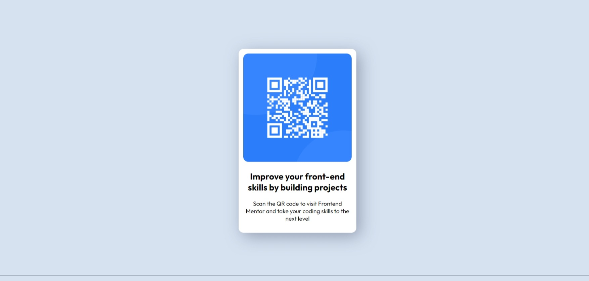

# Frontend Mentor - QR code component solution

This is a solution to the [QR code component challenge on Frontend Mentor](https://www.frontendmentor.io/challenges/qr-code-component-iux_sIO_H). Frontend Mentor challenges help you improve your coding skills by building realistic projects. 

## Table of contents

- [Overview](#overview)
  - [Screenshot](#screenshot)
  - [Links](#links)
  - [Built with](#built-with)
- [Author](#author)
- [Acknowledgments](#acknowledgments)

## Overview
### Screenshot

### Links

- Solution URL: <https://www.frontendmentor.io/solutions/solution-using-flexbox-OtTjfM_fFp>
- Live Site URL: <https://beepbot99.github.io/qr-code-component/>

### Built with

- HTML5
- CSS
- Flexbox

## Author

- Github - [BeepBot99](https://github.com/beepbot99)
- Frontend Mentor - [@BeepBot99](https://www.frontendmentor.io/profile/BeepBot99)

## Acknowledgments

I would like to thank [Codecademy](https://codecademy.com) for teaching me how to use flexboxes.
